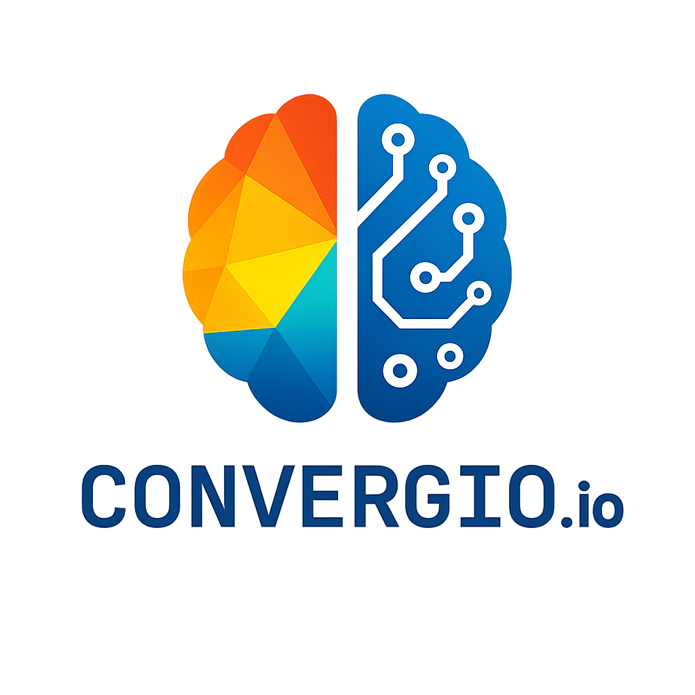

# 🚀 Convergio — Human purpose. AI momentum.
*"Convergio is the platform that lets solopreneurs blend human ingenuity with AI so seamlessly, it feels like magic."*

> ### 🎉 **v2.1.0 Released — Ollama-First AI Provider System!**
> Run Convergio 100% offline with **Ollama** for $0 cost, or connect to **Azure OpenAI** for enterprise-grade AI. Full provider control with 4 modes: ollama_only, azure_only, hybrid, cloud_first. [See release notes →](https://github.com/Roberdan/Convergio/releases/tag/v2.1.0)

> **v2.0.0** — Microsoft Agent Framework Migration Complete! [See v2.0.0 →](https://github.com/Roberdan/Convergio/releases/tag/v2.0.0)

Convergio is the AI‑first orchestration platform where human ingenuity converges with a coordinated crew of specialized agents. Through intelligent coordination—not just parallel processing—they plan together, execute seamlessly, and explain outcomes across your tools.

[](https://github.com/Roberdan/Convergio/actions/workflows/ci.yml)
[](https://github.com/Roberdan/Convergio/releases/tag/v2.0.0)
[](https://python.org)
[](https://fastapi.tiangolo.com/)
[](https://kit.svelte.dev/)
[](https://github.com/microsoft/agent-framework)
[](LICENSE)

---

## 🆕 What's New in v2.1.0 (December 2025)

### Ollama-First AI Provider System

Run Convergio with **full control** over your AI providers. Choose privacy, cost, or quality based on your needs:

| Mode | Description | Cost | Privacy |
|------|-------------|------|---------|
| **Ollama-Only** | 100% local, works offline | FREE ($0) | Maximum |
| **Azure-Only** | Enterprise cloud with SLA | $$$ | Enterprise |
| **Hybrid** | Local for simple, cloud for complex | $ - $$$ | Configurable |
| **Cloud-First** | Best quality (OpenAI/Anthropic) | $$$ | Cloud |

**Key Features:**
- **Strict Mode** — Block all cloud API calls when using ollama_only (no surprise costs)
- **Per-Agent Override** — Configure specific agents to use different providers
- **Per-Feature Override** — Route chat, code review, embeddings to different providers
- **Real-time Cost Tracking** — See exactly what each provider costs ($0 for Ollama)
- **Azure Cost Management API** — Integrate with Azure's billing APIs for exact cost monitoring
- **GPU Detection** — Automatic detection of GPU availability for optimal model selection

**Quick Start with Ollama:**
```bash
# Install Ollama (macOS/Linux)
curl -fsSL https://ollama.com/install.sh | sh

# Pull recommended models
ollama pull llama3.2:latest       # General chat (3B, fast)
ollama pull qwen2.5-coder:7b      # Code review (7B)
ollama pull nomic-embed-text      # Embeddings

# Start Convergio in Ollama-only mode
export AI_PROVIDER_MODE=ollama_only
export AI_STRICT_MODE=true
```

---

## What's New in v2.0.0 (December 2025)

This major release represents a complete architectural evolution:

| Component | Before | After |
|-----------|--------|-------|
| **Framework** | Microsoft AutoGen | Microsoft Agent Framework 1.0 |
| **Orchestration** | GroupChat-based | Modern patterns with streaming |
| **Memory** | Basic persistence | Enhanced context management |
| **Tools** | Scattered | Unified Tools Registry |
| **Docker** | Not included | Production-ready Dockerfiles |

**Key Improvements:**
- **AgentFrameworkOrchestrator** — New orchestrator with improved performance and native streaming
- **Dual-Framework Adapters** — Backward compatibility layer for gradual migration
- **Feature Flags** — Controlled rollout with `FrameworkFeatureFlags`
- **431+ Tests Passing** — Comprehensive test coverage including 276 new framework tests
- **Enhanced Memory System** — Dedicated `AgentFrameworkMemory` with optimized context

📖 [Full migration documentation →](docs/adr/ADR-001-MIGRATION-TO-AGENT-FRAMEWORK.md)

---

## 🗞️ What this is (and why it matters)

- Convergio is a unified, production‑leaning reference implementation of a multi‑agent platform built on top of Microsoft Agent Framework. It demonstrates how to compose dozens of purpose‑built agents into reliable workflows with modern orchestration patterns. See Microsoft Agent Framework on GitHub: https://github.com/microsoft/agent-framework
- Our north star is the Agentic Manifesto and inclusive design. Start here:
  - Agentic Manifesto: [AgenticManifesto/AgenticManifesto.md](AgenticManifesto/AgenticManifesto.md)
  - What is Convergio: [AgenticManifesto/WhatIsConvergio.md](AgenticManifesto/WhatIsConvergio.md)
  - Built for Mario — AI‑First Interface: [AgenticManifesto/💜 For Mario - AI-First Interface.md](AgenticManifesto/💜%20For%20Mario%20-%20AI-First%20Interface.md)
  - Convergio Intro/Pitch: [ConvergioIntro.md](ConvergioIntro.md)
  - Sequoia‑style One‑Pager: [onePager.md](onePager.md)
- Communication meets engineering: this README is both a product primer and a practical guide to run the stack locally.

---

## 🏗️ Architecture (truth, no buzzwords)

- Backend: FastAPI (Python 3.11), SQLAlchemy 2.x (async), PostgreSQL, Redis, Prometheus metrics
- Frontend: SvelteKit + TypeScript + TailwindCSS (dev server on port 4000, proxy to backend 9000)
- AI Orchestration: Multi‑agent system using Microsoft Agent Framework 1.0 with modern orchestration patterns
- Streaming & coordination: internal streaming orchestrator with typed protocols and runners
- Security: security headers, CORS, JWT scaffolding (RS256), optional rate‑limit middleware (currently disabled in code)

No Docker/Kubernetes manifests are provided in this repo. Local developer setup runs with system Postgres + Redis or containers you manage yourself.

### Key capabilities

- Multi‑agent conversations with tool use, memory, and specialization
- Agent planner/critic loop that turns human intent into plans → actions → verified outcomes
- Hybrid orchestration: AI agents plus human‑in‑the‑loop and human‑on‑demand routing (gig platforms)
- Explainability & provenance: every step auditable ("why this, why now")
- Safety rails & cost governance: approvals, budget caps, per‑agent SLOs
- Accessibility‑first UI (voice, high‑contrast, keyboard, clear status cues)
- GraphFlow for generating workflows from natural language
- Cost tracking, analytics endpoints, and observability hooks
- Vector search utilities for RAG‑style enrichment
- **Dynamic Theme System**: Light/dark/system mode with persistent preferences

---

## 🚀 Quick Start

### Prerequisites

- Python 3.11+
- Node.js 18+
- PostgreSQL 14+
- Redis 6+
  

### Installation

1. **Clone the repository**
```bash
git clone https://github.com/Roberdan/Convergio.git
cd convergio
```

2. **Backend Setup**
```bash
cd backend
python -m venv venv
source venv/bin/activate  # On Windows: venv\Scripts\activate
pip install -r requirements.txt

# Configure environment (see example below)
# Initialize DB with provided SQL (see commands below)
# Start backend
uvicorn src.main:app --reload --port 9000
```

3. **Frontend Setup**
```bash
cd frontend
npm install

# Start frontend (dev server on :4000)
npm run dev
```

4. **Access the application**
- Frontend: http://localhost:4000
- Backend API: http://localhost:9000
- API Documentation: http://localhost:9000/docs

---

## 📁 Project Structure

```
convergio/
├── 📄 README.md                          # This file
├── 📄 LICENSE                            # BSL 1.1 License
├── 📄 VERSION                            # Version tracking
├── 📄 start.sh                          # Quick start script
├── 📄 test.sh                           # Comprehensive test runner
├── 📄 pytest.ini                        # Test configuration
│
├── 📁 backend/                           # FastAPI backend (Python 3.11+)
│   ├── 📄 requirements.txt              # Python dependencies
│   ├── 📄 pyproject.toml               # Python project config
│   ├── 📄 validate_imports.py          # Import consistency validator
│   └── 📁 src/                          # Source code
│       ├── 📄 main.py                   # FastAPI application entry
│       ├── 📁 api/                      # REST API endpoints
│       ├── 📁 agents/                   # AI agent definitions & orchestration
│       ├── 📁 core/                     # Core utilities (database, config, etc.)
│       ├── 📁 models/                   # SQLAlchemy models
│       └── 📁 services/                 # Business logic services
│
├── 📁 frontend/                          # SvelteKit frontend (TypeScript)
│   ├── 📄 package.json                  # NPM dependencies
│   ├── 📄 svelte.config.js             # SvelteKit configuration
│   ├── 📄 tailwind.config.js           # TailwindCSS configuration
│   ├── 📄 playwright.config.ts         # E2E test configuration
│   └── 📁 src/                          # Source code
│       ├── 📁 lib/                      # Reusable components & utilities
│       └── 📁 routes/                   # SvelteKit pages & API routes
│
├── 📁 docs/                             # Documentation
│   ├── 📄 API_REFERENCE.md             # Complete API documentation
│   ├── 📄 ADMIN_GUIDE.md               # Administrator guide
│   ├── 📄 AGENTS.md                    # AI agents catalog
│   ├── 📄 IMPORT_PATH_CONSISTENCY_GUIDE.md  # Import standards (moved)
│   ├── 📄 PM_DASHBOARD_IMPLEMENTATION_SUMMARY.md  # Dashboard docs (moved)
│   └── 📄 USER_GUIDE.md                # End user guide
│
├── 📁 scripts/test/                     # Test automation scripts (organized)
│   ├── 📄 01_test_backend_unit.sh       # Backend unit tests
│   ├── 📄 02_test_backend_integration.sh # Backend integration tests
│   ├── 📄 03_test_backend_e2e.sh        # Backend E2E tests
│   └── 📄 ...                          # Additional test scripts
│
├── 📁 tests/                            # Main test directory
│   ├── 📄 conftest.py                   # Pytest configuration
│   ├── 📄 master_test_runner.py        # Central test orchestration
│   └── 📁 backend/                      # Backend-specific tests
│
└── 📁 logs/                             # Test execution logs (auto-generated)
    └── 📄 test_*.log                    # Individual test execution logs
```

### 🔑 Key Directories

- **`backend/src/agents/definitions/`** - 54 specialized AI agent definitions (synced from ConvergioCLI)
- **`backend/src/api/`** - FastAPI routers for all endpoints
- **`frontend/src/lib/components/`** - Reusable Svelte components
- **`docs/`** - Comprehensive documentation (organized and updated)
- **`scripts/test/`** - All test automation scripts (organized from root)

---

## 📚 Documentation

### Core Documentation
- **Implementation Report**: [docs/IMPLEMENTATION_COMPLETE.md](docs/IMPLEMENTATION_COMPLETE.md) - Complete implementation details
- **System Verification**: [docs/COMPREHENSIVE_VERIFICATION_REPORT_AUG2025.md](docs/COMPREHENSIVE_VERIFICATION_REPORT_AUG2025.md)
- **Agent Definitions**: [docs/AGENTS.md](docs/AGENTS.md) - All 54 agents documented (synced from ConvergioCLI)
- **Database Schema**: [docs/DataBaseSchema.md](docs/DataBaseSchema.md)
- **Security System**: [docs/SECURE_COST_SYSTEM_VERIFICATION.md](docs/SECURE_COST_SYSTEM_VERIFICATION.md)
- **Import Path Guide**: [docs/IMPORT_PATH_CONSISTENCY_GUIDE.md](docs/IMPORT_PATH_CONSISTENCY_GUIDE.md) - Import standards (organized)
- **PM Dashboard Docs**: [docs/PM_DASHBOARD_IMPLEMENTATION_SUMMARY.md](docs/PM_DASHBOARD_IMPLEMENTATION_SUMMARY.md) - Dashboard implementation (organized)

- **Intro/Pitch**: [ConvergioIntro.md](ConvergioIntro.md)
- **Sequoia-style One-Pager**: [onePager.md](onePager.md)

### Agent System
- **Agent Definitions**: backend/src/agents/definitions/
- **Orchestrators & resilience**: backend/src/agents/orchestrators/
- **Ali Proactive Intelligence**: backend/src/agents/ali_ceo.py

### Enterprise Features
- **Cost Management**: [docs/cost-tracking-system.md](docs/cost-tracking-system.md)
- **Multi-tenancy**: Complete SaaS platform with Stripe billing
- **Real Data Integrations**: [docs/REAL_DATA_INTEGRATIONS.md](docs/REAL_DATA_INTEGRATIONS.md)
- **Security Compliance**: OWASP Top 10 compliance and comprehensive audit trail; explainable plans and approvals by default

### Live Documentation
- **Swagger UI**: http://localhost:9000/docs
- **ReDoc**: http://localhost:9000/redoc

---

## 🤖 Multi‑agent ecosystem

Convergio features a comprehensive multi‑agent system of specialized agents organized into functional domains:

### Leadership & Strategy (6 agents)
- **Ali** - Chief of Staff & Proactive Intelligence Engine
- **Amy** - Chief Financial Officer
- **Satya** - Board of Directors Representative  
- **Antonio** - Strategy Expert
- **Matteo** - Strategic Business Architect
- **Domik** - McKinsey Strategic Decision Maker

### Project Management & Operations (8 agents)
- **Davide** - Project Manager
- **Oliver** - Project Manager
- **Marcus** - Project Manager
- **Luke** - Program Manager
- **Wanda** - Workflow Orchestrator
- **Taskmaster** - Strategic Task Decomposition Master
- **Dave** - Change Management Specialist
- **Xavier** - Coordination Patterns Expert

### Technology & Engineering (12 agents)
- **Dan** - Engineering General Manager
- **Baccio** - Tech Architect
- **Marco** - DevOps Engineer
- **Luca** - Security Expert
- **Guardian** - AI Security Validator
- **Thor** - Quality Assurance Guardian
- **Rex** - Code Reviewer (NEW - synced from ConvergioCLI)
- **Paolo** - Best Practices Enforcer (NEW - synced from ConvergioCLI)
- **Otto** - Performance Optimizer (NEW - synced from ConvergioCLI)
- **Dario** - Systematic Debugger (NEW - synced from ConvergioCLI)
- **Fiona** - Market Analyst (NEW - synced from ConvergioCLI)
- **Anna** - Executive Assistant (NEW - synced from ConvergioCLI)

### Data & Analytics (6 agents)
- **Angela** - Data Analyst
- **Ethan** - Data Analyst
- **Ethan IC6** - Senior Data Analyst
- **Omri** - Data Scientist
- **Ava** - Analytics Insights Virtuoso
- **Diana** - Performance Dashboard Expert

### Business Development & Sales (4 agents)
- **Fabio** - Sales & Business Development
- **Michael** - Venture Capitalist
- **Wiz** - Investor & Venture Capital
- **Sam** - Startup Expert

### Human Resources & Culture (4 agents)
- **Giulia** - HR Talent Acquisition
- **Coach** - Team Coach
- **Behice** - Cultural Coach
- **Jenny** - Inclusive Accessibility Champion

### Creative & Communication (5 agents)
- **Sara** - UX/UI Designer
- **Jony** - Creative Director
- **Riccardo** - Storyteller
- **Steve** - Executive Communication Strategist
- **Sofia** - Marketing Strategist

### Customer Success & Compliance (5 agents)
- **Andrea** - Customer Success Manager
- **Elena** - Legal Compliance Expert
- **Dr. Enzo** - Healthcare Compliance Manager
- **Sophia** - Government Affairs
- **Enrico** - Business Process Engineer

### AI & Optimization (4 agents)
- **PO** - Prompt Optimizer
- **Marcus** - Context Memory Keeper
- **Socrates** - First Principles Reasoning
- **Stefano** - Design Thinking Facilitator

Each agent is powered by advanced AI capabilities including:
- **Context-aware reasoning** with per-turn RAG
- **Tool execution** with intelligent selection
- **Memory persistence** across conversations
- **Security validation** and compliance checks
- **Cost optimization** and rate limiting
- **Real-time collaboration** and coordination

---

## 🧪 Testing

### Test Suite Status (December 2025)

✅ **All test scripts systematically fixed and optimized**

#### Backend Tests
- **Unit Tests**: 431+ passing ✅
- **Integration Tests**: All passing ✅
- **E2E Tests**: Core tests passing ✅
- **AI Provider Tests**: 41 passing, 2 skipped ✅
- **Ollama E2E Tests**: 24 passing ($0 cost) ✅ NEW
- **Security Tests**: All core security validations passing ✅
- **Performance Tests**: Load testing and metrics collection working ✅

#### Frontend Tests
- **Unit Tests (Vitest)**: Core functionality tests passing ✅
- **E2E Tests (Playwright)**: Core tests passing ✅
- **Accessibility Tests**: All accessibility requirements met ✅
- **Component Tests**: Dashboard, agents, talents, navigation all working ✅

### Quick Test Execution

```bash
# Run all backend tests
cd backend
pytest tests/ -v

# Run all frontend tests
cd frontend
npm run test        # Unit tests
npm run test:e2e    # E2E tests

# Run specific test categories
./08_test_frontend_e2e.sh    # Frontend E2E (optimized)
./09_test_master_runner.sh   # Master test orchestration
./10_test_go_backend.sh      # Go backend tests
./11_test_backend_top_level.sh # Top-level Python tests
```

### Test Scripts (All Fixed & Optimized)

**Production-Ready Test Scripts:**
- ✅ `./08_test_frontend_e2e.sh` - Frontend E2E with Playwright (fixed strict mode issues)
- ✅ `./09_test_master_runner.sh` - Master test orchestration (Redis async fixes)
- ✅ `./10_test_go_backend.sh` - Go backend tests (handles no Go files gracefully)
- ✅ `./11_test_backend_top_level.sh` - Top-level tests (macOS compatibility fixed)

**Additional Test Categories:**
- `./01_test_backend_unit.sh` - Backend unit tests
- `./02_test_backend_integration.sh` - Backend integration tests  
- `./03_test_backend_e2e.sh` - Backend E2E tests
- `./04_test_security.sh` - Security validation tests
- `./05_test_performance.sh` - Performance and load tests

---

## 🎨 UI/UX Features (August 2025)

### Dynamic Theme System
- **Light/Dark/System Mode**: Automatic OS theme detection with manual override
- **Persistent Preferences**: Theme choice saved in localStorage
- **Surface Color System**: `surface-0` to `surface-950` with dark mode variants
- **Component Theming**: 800+ hardcoded colors replaced with dynamic theme classes

### User Interface
- **Ali Assistant**: Floating chat interface with real-time AI coordination
- **Project Management**: Gantt charts and Kanban boards with dynamic theming
- **Analytics Dashboard**: Real-time metrics and cost tracking
- **Agent Management**: Visual agent orchestration and status monitoring

### Theme Toggle
Access theme controls via the toggle in the top-right header (next to cost display):
- 🌞 Light mode
- 🌙 Dark mode  
- 🖥️ System (follows OS preference)

---

### Additional Test Categories
- `./06_test_frontend_unit.sh` - Frontend unit tests (Vitest)
- `./07_test_frontend_storybook.sh` - Storybook component tests

### Recent Test Improvements (August 2025)

**Frontend E2E Optimizations:**
- Fixed Playwright strict mode violations in dashboard tests
- Updated agent selector strategies for dynamic UI elements
- Improved navigation test flexibility for responsive design
- Skipped complex AI orchestration tests pending full implementation

**Backend Test Stabilization:**
- Resolved SQLAlchemy async session management issues
- Fixed Redis connection handling with proper async/await patterns
- Enhanced database test isolation and cleanup procedures
- Improved cross-platform shell script compatibility

**Test Infrastructure:**
- All test scripts now handle edge cases gracefully
- Enhanced error reporting and debugging capabilities
- Optimized test execution times with parallel processing
- Added comprehensive test coverage reporting

### Tips & Best Practices

```bash
# Continue-on-error mode
FAIL_FAST=false ./08_test_frontend_e2e.sh

# Verbose output for debugging
VERBOSE=true ./09_test_master_runner.sh

# Run specific test patterns
npx playwright test --grep "dashboard" # Frontend specific tests
pytest tests/ -k "cost_tracking"       # Backend specific tests
```
---

## ⚙️ Environment variables (backend/.env)

Minimal set to get running locally:

```bash
# Environment
ENVIRONMENT=development
DEBUG=true

# Security (generate strong JWT secret for production)
JWT_SECRET=your_super_secure_jwt_secret_that_should_be_very_long_and_random_at_least_64_chars
JWT_ALGORITHM=RS256

# Database
POSTGRES_HOST=localhost
POSTGRES_PORT=5432
POSTGRES_DB=convergio_db
POSTGRES_USER=postgres
POSTGRES_PASSWORD=postgres

# Redis
REDIS_HOST=localhost
REDIS_PORT=6379
REDIS_DB=1

# Network Configuration
DEFAULT_HOST=localhost
FRONTEND_PORT=4000
BACKEND_PORT=9000
API_PORT=9000
ADMIN_PORT=9001

# User Configuration
DEFAULT_USER_ID=system_user
DEFAULT_ANONYMOUS_USER=system_anonymous
DEFAULT_TEST_USER=system_test_user

# Feature Configuration
REFERENCE_AGENT_TRUNCATE_LENGTH=3000
RATE_LIMIT_ENABLED=true
RATE_LIMIT_PER_MINUTE_API=100

# AI Provider Configuration (NEW in v2.1.0)
AI_PROVIDER_MODE=ollama_only       # ollama_only | azure_only | hybrid | cloud_first
AI_STRICT_MODE=true                 # Block cloud calls in ollama_only mode
OLLAMA_HOST=http://localhost:11434 # Ollama server URL
OLLAMA_DEFAULT_MODEL=llama3.2:latest

# Azure OpenAI (for enterprise)
AZURE_OPENAI_ENDPOINT=https://your-resource.openai.azure.com/
AZURE_OPENAI_API_KEY=your-key
AZURE_OPENAI_DEPLOYMENT=gpt-4o-deployment
AZURE_OPENAI_API_VERSION=2024-02-15-preview

# Direct Cloud AI (for cloud_first mode)
OPENAI_API_KEY=sk-...
ANTHROPIC_API_KEY=sk-ant-...
GRAPHFLOW=true

# Health Monitoring
HEALTH_CHECK_ENABLED=true
LOG_LEVEL=INFO
```

> 📝 **Note**: For a complete list of all available environment variables with detailed explanations, see `.env.example` in the project root.

---

## 🤝 Contributing

We welcome contributions! Please see [docs/CONTRIBUTING.md](docs/CONTRIBUTING.md) for guidelines.

### Development Workflow
1. Fork the repository
2. Create a feature branch (`git checkout -b feature/amazing-feature`)
3. Commit your changes (`git commit -m 'Add amazing feature'`)
4. Push to the branch (`git push origin feature/amazing-feature`)
5. Open a Pull Request

### Code Standards
- Python: Black + Ruff + mypy
- TypeScript: ESLint + Prettier
- Commits: Conventional Commits specification
- Tests: Required for all new features

---

## 📊 Observability & performance

- Prometheus metrics exposed at /metrics
- Structured logs (JSON) via structlog; configure via LOG_LEVEL, LOG_FORMAT
- Connection pooling for Postgres and Redis; tune via DB_* and REDIS_* settings

---

## 📄 License

This project is licensed under the Business Source License 1.1 - see the [LICENSE](LICENSE) file for details.

After the change date (2027-01-01), this software will be available under the Apache 2.0 license.

---

## 🙏 Acknowledgments

- Microsoft Agent Framework team for the modern multi-agent framework
- OpenAI for GPT models powering our agents
- Anthropic for Claude models used in development
- The open-source community for invaluable tools and libraries

---

## 📞 Support

- Issues: https://github.com/Roberdan/Convergio/issues
- Discussions: https://github.com/Roberdan/Convergio/discussions

---

## 🚀 Roadmap

### Q4 2025 (Current)
- [x] Agent Sync from ConvergioCLI (54 agents with enhanced prompts)
- [x] Anti-Hallucination Protocol for all agents
- [x] Delegation Pattern [DELEGATE:] support
- [x] **WS6: Ollama-First AI Provider System** — 100% offline with $0 cost
- [x] **Azure OpenAI Enterprise Integration** — SLA-backed cloud AI
- [x] **4 Provider Modes** — ollama_only, azure_only, hybrid, cloud_first
- [x] **Strict Mode** — No surprise cloud costs
- [x] **Per-Agent/Feature Provider Override** — Fine-grained control
- [x] **24 E2E Tests** — Full test coverage for AI providers
- [ ] Advanced AI agents marketplace
- [ ] Mobile applications (iOS/Android)

### Q1 2026 - Unified Workforce (see [2026Plan.md](2026Plan.md))
- [ ] **WS2: Enhanced People Model** - Skills, rates, availability tracking
- [ ] **WS3: Unified Workforce UI** - People + AI agents as one team
- [ ] **WS6-G6: Azure Cost Management API** - Exact cost monitoring via Azure APIs
- [ ] Project team composition (assign people + agents to projects)
- [ ] Resource allocation with real data (no more mock data)
- [ ] Skill matrix and capacity planning

### Q2 2026
- [ ] Workflow Engine (DAG-based from ConvergioCLI)
- [ ] Group Chat consensus building
- [ ] AI model fine-tuning capabilities
- [ ] Enterprise SSO integration

---

**Built with ❤️ for Mario by the Convergio Team**

*Making AI work for humans, not the other way around.*